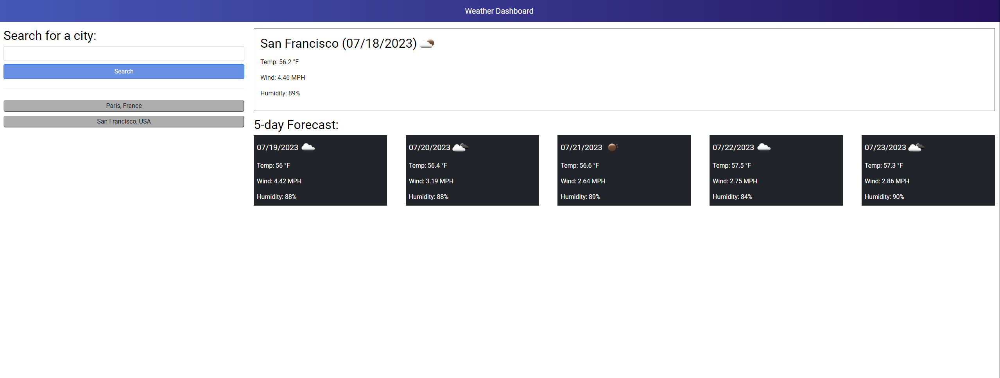

# Tybalt Mallet's Weather Forecast Dashboard

## Description
This is the Module 6 challenge for the sixth week of the UCB coding bootcamp. For this project we were given nothing but an API website with documentation, and were told to make a website where the user can search a city name, and get information about the locations current weather, and the forecast 5 days in advance taken from the API. The users previous search history is also stored in local storage, and is easily accessible by buttons that appear every time you search a new city on the left hand side of the page. 

## Project Link

https://notuneeven.github.io/Weather-Forecast-Dashboard/

## Screenshot of Website

## Usage 

This website can be used as a way to check the current/upcoming weather in almost any city around the world. It also will be a very useful study tool to look back on to refresh myself on how to use APIs and their documentation, as well as all the other tools I used such as JavaScript, Jquery, bootstrap, etc. 

## Credits 

N/A

## License 

N/A
